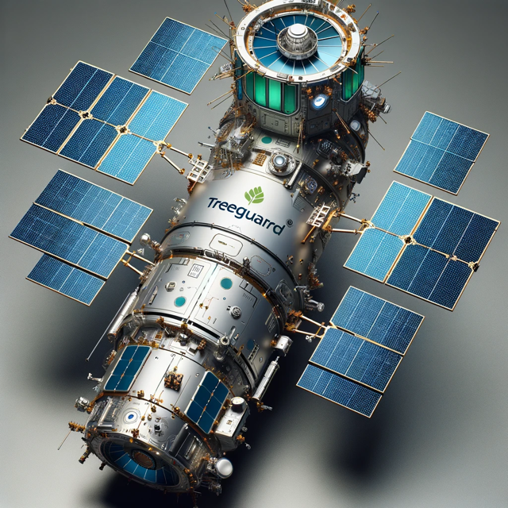

## Technology Behind TreeGuard AI

 

The idea for TreeGuard was first inspired by [an article about team of researchers at NASA](https://phys.org/news/2023-03-nasa-captures-sequestered-carbon-billion.html) who utilized satellite imagery and artificial intelligence to chart billions of individual tree crowns, allowing them to obtain an extremely accurate and precise mapping of many of the North African terrain. Employing allometric equations from earlier tree samplings, the researchers were then able translate these images into quantifiable estimates of tree biomass, including wood, foliage, roots, and their carbon sequestration capabilities.

Researchers took a set of 30,000 satellite images and, using a deep-learning-based tree mapping which had been trained on a data set of 90,000 trees, they were able to measure about 9.9 billion individual trees; this method of counting trees and assessing other parts of the terrain is extremely accurate, avoids the overestimates common of other forms of tree counting, which usually consists of counting a designated area within the given terrain and then extrapolating out from there.

 
