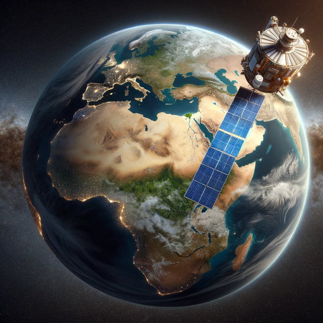

## The Technolog Behind TreeGuard

The idea for TreeGuard was first inspired by [an article about team of researchers at NASA](https://phys.org/news/2023-03-nasa-captures-sequestered-carbon-billion.html) who utilized satellite imagery and artificial intelligence to chart billions of individual tree crowns, allowing them to obtain an extremely accurate and precise mapping of many of the North African terrain. Employing allometric equations from earlier tree samplings, the researchers were then able translate these images into quantifiable estimates of tree biomass, including wood, foliage, roots, and their carbon sequestration capabilities.

