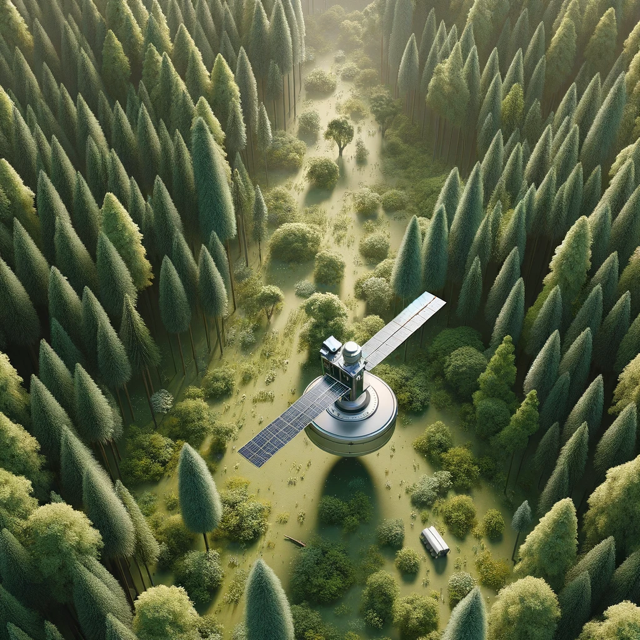
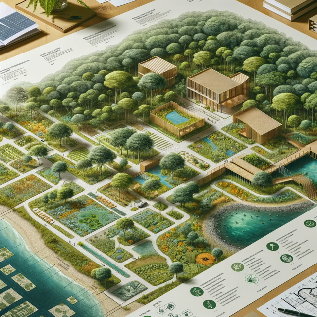
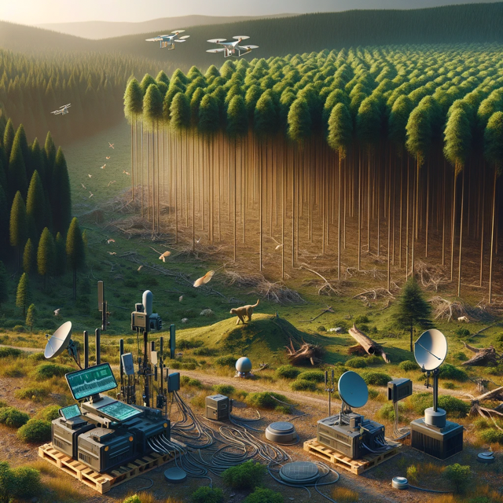

## TreeGuard AI's Value Proposition

> *Leveraging deep learning techniques and thousands of ecological data sets to create precise mappings of the terrain.*

 
 

AI-Powered, Eco-Inspired.

### Existing Problems Within Construction

1. Surveying Challenge Terrain with Complex Landforms
2. Crafting a Detail Conceptual Site Model
3. Long Wait Times To Obtain A Building Permit

  *TreeGuard's cutting-edge tech uses satellite imagery and artificial intelligence to streamline land surveys, offering detailed mappings and 3D models, which expedites the permitting, planning, and building processes.*

### Market Opportunities

1. Commercial Construction Industry
2. Residential Construction Industry
3. Environmental Monitoring
4. Carbon Credit Trade Market
5. Commercial Farming

*Outside of the commercial and residential construction industries, there are also major potential impacts in areas such as environmental monitoring and regulation, the carbon credit trade market, and commercial farming.*

Check the [GitHub repository](https://github.com/carolinebegg/hugo-mock-landing-page) for the release notes.
